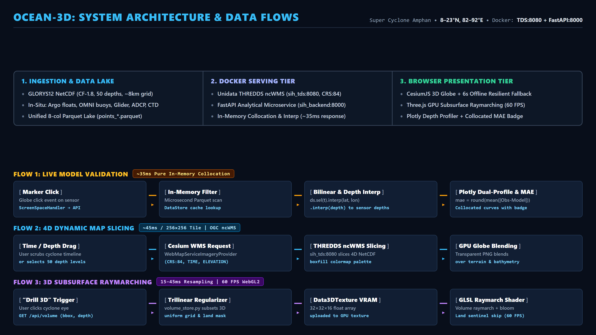

# OCEAN-3D: Interactive 4D/3D Ocean Digital Twin & In-Situ Observation Integration Platform

[](https://sih.gov.in/)
[]()
[](https://fastapi.tiangolo.com)
[](https://react.dev/)
[](https://cesium.com/)
[](https://threejs.org/)
[](https://www.unidata.ucar.edu/software/tds/)
[](LICENSE)

> **A web-based 4D/3D ocean visualization and validation platform that seamlessly integrates numerical ocean model outputs (GLORYS12V1) with multi-platform in-situ ocean observations (Argo floats, INCOIS OMNI buoys, underwater gliders, ADCP moorings, CTD casts, and ASCII CSVs).**

---

## Table of Contents
1. [Problem Statement & Background](#problem-statement--background)
2. [Proposed Solution: The Ocean-3D Digital Twin](#proposed-solution-the-ocean-3d-digital-twin)
3. [Key Platform Features](#key-platform-features)
4. [System Architecture & Data Flows](#system-architecture--data-flows)
5. [Tech Stack & Standards Compliance](#tech-stack--standards-compliance)
6. [Repository Structure](#repository-structure)
7. [Getting Started (Run Locally on Your PC)](#getting-started-run-locally-on-your-pc)
   - [Prerequisites](#prerequisites)
   - [Step 1: Clone the Repository](#step-1-clone-the-repository)
   - [Step 2: Start the Backend & TDS via Docker](#step-2-start-the-backend--tds-via-docker)
   - [Step 3: Launch the Frontend](#step-3-launch-the-frontend)
   - [Alternative: Running Without Docker](#alternative-running-without-docker)
8. [Data Ingestion Pipeline](#data-ingestion-pipeline)
9. [REST API & OGC WMS Contracts](#rest-api--ogc-wms-contracts)
10. [Automated Verification & Tests](#automated-verification--tests)
11. [Data Sources & Acknowledgements](#data-sources--acknowledgements)

---

## Problem Statement & Background

### The Context
India's Exclusive Economic Zone (EEZ) spans over **2.37 million km²** alongside a coastline of **~7,500 km**. Safeguarding maritime assets, supporting fisheries, predicting monsoon patterns, and warning coastal communities against extreme weather events like tropical cyclones requires continuous, high-resolution monitoring of ocean state variables (temperature, salinity, currents, chlorophyll, and mixed-layer depth).

The **Indian National Centre for Ocean Information Services (INCOIS)** routinely generates high-resolution numerical ocean model outputs and collects massive volumes of in-situ marine observations from autonomous platforms:
- **Numerical Ocean Models**: High-resolution 3D/4D gridded outputs (stored in CF-compliant NetCDF files) spanning multiple vertical depths, spatial grids, and temporal steps.
- **In-Situ Observational Networks**: Autonomous profiling instruments including Argo floats, INCOIS OMNI moored buoys, underwater gliders, acoustic Doppler current profilers (ADCP), shipboard CTD casts, and ASCII/text records.

### The Operational Challenge
Despite the richness of these datasets, operational forecasters, researchers, and students face severe bottlenecks:
1. **Tool Fragmentation**: Modelers and forecasters must juggle disparate desktop GIS tools (QGIS, Panoply, Ferret) and offline Python scripts to compare gridded model predictions against sensor observations.
2. **Context-Switching & Slow Verification**: Correlating whether a model's simulated thermal structure matches a real Argo profile during a developing cyclone requires manual coordinate extraction, offline depth interpolation, and custom plotting.
3. **Absence of Unified 3D Volumetric Depth**: Most ocean platforms restrict users to flat 2D surface slices or pre-rendered contours. Forecasters cannot interactively inspect the vertical water column in full 3D to examine barrier layers, thermocline shoaling, or cyclone-induced cold wakes.
4. **Demo-Day Online Fragility**: Many modern web GIS tools fail catastrophically during live demos or field operations if internet connectivity drops or external map tile servers time out.

---

## Proposed Solution: The Ocean-3D Digital Twin

**Ocean-3D** bridges the gap between numerical simulations and in-situ observations by providing a single, browser-native 3D ocean digital twin.

- **Flagship Demonstration Scenario**: **Super Cyclone Amphan** (Bay of Bengal, May 13–25, 2020).
- **Bounding Box**: `8.0°N – 23.0°N`, `82.0°E – 92.0°E` ($181 \times 121$ spatial grid at $1/12^\circ \approx 8\text{ km}$ resolution).
- **Vertical Extent**: 50 non-uniform vertical depth levels ranging from $0.494\text{ m}$ (surface) down to $5,727.9\text{ m}$ (deep bathymetry).
- **In-Situ Coverage**: 30 unique instruments and 17,917 observations collocated across space and time.

```
┌─────────────────────────────────────────────────────────────────────────────────────────────┐
│                          OCEAN-3D: SYSTEM ARCHITECTURE & DATA FLOWS                         │
│  Super Cyclone Amphan • 8–23°N, 82–92°E • Docker: TDS:8080 + FastAPI:8000                   │
├──────────────────────────────┬──────────────────────────────┬───────────────────────────────┤
│ 1. INGESTION & DATA LAKE     │ 2. DOCKER SERVING TIER       │ 3. BROWSER PRESENTATION TIER  │
│ • GLORYS12 NetCDF (CF-1.8)   │ • Unidata THREDDS ncWMS      │ • CesiumJS 3D Globe + Offline │
│ • Argo, Buoys, Glider, ADCP  │ • FastAPI Microservice       │ • Three.js GPU Raymarch 60FPS │
│ • Unified 8-col Parquet Lake │ • Real-Time Interp Engine    │ • Plotly Depth Profiler + MAE │
└──────────────────────────────┴──────────────────────────────┴───────────────────────────────┘
```

---

## Key Platform Features

### 1. 4D Spatiotemporal Exploration
- **Temporal Scrubbing**: An interactive time scrubber spans the 13-day lifecycle of Super Cyclone Amphan, from pre-cyclone intensification to peak Category 5 super cyclonic storm and post-landfall dissipation.
- **50 Discrete Vertical Depth Levels**: Real GLORYS12 depth levels (from $0.494\text{ m}$ to $5,728\text{ m}$) are dynamically sliced, allowing users to peel through the surface mixed layer, thermocline, and abyssal depths.

### 2. Multi-Platform In-Situ Observation Lake
- Ingests real-world observations from **Argo profiling floats** (including biogeochemical chlorophyll-a), **INCOIS OMNI moored buoys** (BD08, BD11, BD14), **BoBBLE Seagliders** (SG620), **ADCP moorings**, shipboard **CTD casts**, and **ASCII CSV** data.
- Standardized into an 8-column columnar Parquet data lake with microsecond filtering:
  `[lat, lon, depth, time, variable, value, instrument_id, instrument_type]`.

### 3. Instant Ground-Truth Model Validation & MAE Metric
- Click any instrument marker on the 3D globe to trigger immediate, on-the-fly collocation.
- The FastAPI backend performs **horizontal bilinear interpolation** (`lat`, `lon`) on the NetCDF model grid followed by **1D linear depth interpolation** directly to the sensor's exact sampling depths without extrapolation.
- Renders collocated observed vs. modeled curves on a synchronized Plotly chart with a live **Mean Absolute Error (MAE)** badge in under **35 ms**.

### 4. GPU-Accelerated 3D Volumetric Subsurface Engine
- Click **"Drill into 3D"** on any storm feature (such as the cyclone eye) to inspect a full 3D water-column cube.
- The analytical engine regularizes non-uniform ocean depths via trilinear interpolation into a uniform $32 \times 32 \times 16$ grid with `-9999.0` land sentinel masking.
- Direct WebGL2 GLSL fragment shader raymarching and Marching Cubes isosurface extraction with UnrealBloom post-processing run smoothly at **60 FPS** without browser lag.

### 5. Stage 10 Zero-Hang Offline Resilience
- Engineered for uninterrupted live demonstrations and low-bandwidth operational centers.
- Features a **6-second zero-hang timeout interceptor** on external Cesium Ion asset requests.
- If internet connectivity is unavailable or severed during runtime, the viewer automatically falls back to bundled local **NaturalEarthII** imagery and synchronous `EllipsoidTerrainProvider` without crashing or freezing.

### 6. 5-Beat Guided Cyclone Tour
- An interactive story mode with cinematic camera transitions and coordinated timeline scrubbing guides users through the oceanographic story of Cyclone Amphan:
  1. *May 13*: Deep tropical ocean heat content buildup ($>31^\circ\text{C}$).
  2. *May 16*: Cyclone genesis in the southern Bay of Bengal.
  3. *May 18*: Rapid intensification to Super Cyclonic Storm with $260\text{ km/h}$ peak winds.
  4. *May 20*: Landfall with intense cyclonic upwelling and a $3\text{--}4^\circ\text{C}$ surface cold wake.
  5. *May 24*: Post-storm barrier layer recovery and chlorophyll bloom triggering.

---

## System Architecture & Data Flows



### The Three End-to-End Traced Flows

#### Flow 1: Live Ground-Truth Model Validation (~35 ms)
```text
[ Marker Click ] ──────▶ [ In-Memory Filter ] ──────▶ [ Bilinear & Depth Interp ] ──────▶ [ Plotly Dual-Profile & MAE ]
Globe click event on sensor     Microsecond Parquet scan       ds.sel(t).interp(lat, lon)        mae = round(mean(|Obs-Model|))
ScreenSpaceHandler → API        DataStore cache lookup         .interp(depth) to sensor depths   Collocated curves with badge
```

#### Flow 2: 4D Dynamic Map Slicing (~45 ms / 256×256 Tile)
```text
[ Time / Depth Drag ] ──▶ [ Cesium WMS Request ] ───▶ [ THREDDS ncWMS Slicing ] ───▶ [ GPU Globe Blending ]
User scrubs cyclone timeline    WebMapServiceImageryProvider   sih_tds:8080 slices 4D NetCDF     Transparent PNG blends
or selects 50 depth levels      (CRS:84, TIME, ELEVATION)      boxfill colormap palette          over terrain & bathymetry
```

#### Flow 3: 3D Subsurface Volumetric Raymarching (60 FPS WebGL2)
```text
[ "Drill 3D" Trigger ] ─▶ [ Trilinear Regularizer ] ─▶ [ Data3DTexture VRAM ] ─────▶ [ GLSL Raymarch Shader ]
User clicks cyclone eye         volume_store.py subsets 3D     32×32×16 float array              Volume raymarch + bloom
GET /api/volume (bbox, depth)   uniform grid & land mask       uploaded to GPU texture           Land sentinel skip (60 FPS)
```

---

## Tech Stack & Standards Compliance

| Component | Technology | Version | Purpose |
|---|---|:---:|---|
| **Frontend Framework** | React + TypeScript | 19.2 / 5.6 | Single-page application, interactive UI state, drawer controls |
| **Build & Dev Tool** | Vite | 8.3 | Ultra-fast HMR and proxy routing to backend & THREDDS |
| **Styling** | Tailwind CSS | v4.3 | High-contrast dark glassmorphism dashboard UI |
| **Geospatial 3D Globe** | CesiumJS | 1.145 | OGC WMS layer rendering, bathymetry, 3D billboarding, offline fallback |
| **Subsurface Volume Engine** | Three.js | 0.186 | WebGL2 GPU raymarching, 3D textures, Marching Cubes isosurfaces |
| **Scientific Charting** | Plotly.js | 4.1 | Interactive multi-axis depth profiles and collocated validation |
| **OGC Standards Server** | Unidata THREDDS (TDS) | 5.8 | OGC WMS 1.3.0 (`CRS:84`), OPeNDAP, and NetCDF subsetting |
| **Analytical Microservice** | FastAPI (Python) | 0.115 / 3.12 | Microsecond in-memory data store, spatial & depth interpolation |
| **Data Engine & Formats** | xarray, pandas, pyarrow | Modern | CF-1.8 NetCDF-4 grid manipulation and normalized Parquet lake |
| **Containerization** | Docker & Docker Compose | 24+ | Multi-service orchestration linking TDS and FastAPI |

---

## Repository Structure

```
SIH-2026/
├── backend/                        # FastAPI Analytical Microservice
│   ├── routers/                    # Endpoint routers (instruments, volume, variables, metadata)
│   ├── config.py                   # Environment settings and paths
│   ├── data_store.py               # In-memory thread-safe Parquet & xarray interpolation engine
│   ├── volume_store.py             # 3D subgrid regularization & land-sentinel masking
│   ├── schemas.py                  # Pydantic contract validation schemas
│   ├── main.py                     # FastAPI application entry point
│   ├── Dockerfile                  # Container definition for backend
│   └── requirements.txt            # Python dependencies
│
├── frontend/                       # React 19 + TypeScript + Vite Client
│   ├── src/
│   │   ├── components/             # UI components (CesiumViewer, VolumetricOverlay, Controls, Drawer)
│   │   ├── lib/                    # Three.js custom shaders (VolumeRaymarchReal.ts, VolumeIsosurfaceReal.ts)
│   │   ├── App.tsx                 # Core application orchestration and state
│   │   └── main.tsx                # React DOM mounting
│   ├── tests/                      # Playwright offline fallback tests
│   ├── package.json                # NPM scripts and dependencies
│   └── vite.config.ts              # Vite dev server and proxy configuration
│
├── ingestion/                      # Automated Data Ingestion Pipelines
│   ├── ingest_glorys12.py          # Copernicus GLORYS12V1 NetCDF-4 reanalysis processor
│   ├── ingest_argo.py              # Argo profiling floats ingestor (Core T/S + BGC Chl-a)
│   ├── ingest_buoy.py              # INCOIS OMNI moored buoys ingestor (BD08/BD11/BD14)
│   ├── ingest_glider.py            # BoBBLE Seaglider SG620 dataset ingestor
│   ├── ingest_adcp.py              # ADCP mooring acoustic Doppler velocity ingestor
│   ├── ingest_ctd.py               # Vertical CTD cast ingestor
│   ├── ingest_ascii_sample.py      # ASCII / CSV text file ingestor
│   ├── sample_data/                # Pre-cached raw source data for offline execution
│   └── output/                     # Generated standardized Parquet datasets
│
├── tds/                            # Unidata THREDDS Data Server Configuration
│   ├── config/                     # catalog.xml, threddsConfig.xml, wmsConfig.xml
│   ├── data/                       # amphan_bob_real.nc (CF-1.8 NetCDF-4 grid)
│   └── cache/                      # TDS runtime tile cache
│
├── docs/                           # Technical Specifications & Architecture Artifacts
│   ├── CONTRACTS.md                # Strict, locked system contracts & schemas
│   ├── system_architecture_clean.png # Presentation-ready architecture flowchart
│   └── system_architecture_clean.html# HTML blueprint for architecture diagram
│
├── tests/                          # Scientific empirical verification tests
│   └── test_volume_empirical.py    # Numerical volume test suite
├── docker-compose.yml              # Container orchestration for TDS (8080) and Backend (8000)
├── AGENTS.md                       # Operational rules and developer conventions
└── README.md                       # Master repository documentation
```

---

## Getting Started (Run Locally on Your PC)

Follow these steps to run the complete platform locally on your machine.

### Prerequisites
Make sure you have the following installed on your machine:
- **Git**: [git-scm.com](https://git-scm.com/)
- **Docker & Docker Compose**: [docker.com](https://www.docker.com/products/docker-desktop/) (recommended for running TDS and backend)
- **Node.js**: v18.0 or higher [nodejs.org](https://nodejs.org/)
- **Python**: v3.10 to v3.12 [python.org](https://www.python.org/)

---

### Step 1: Clone the Repository
```bash
git clone https://github.com/VRAJ-710/SIH-2026.git
cd SIH-2026
```

---

### Step 2: Start the Backend & TDS via Docker (Recommended)

Start the Unidata THREDDS Data Server and the FastAPI backend using Docker Compose:

```bash
docker compose up -d
```

Verify that both containers are running:
```bash
docker compose ps
```
You will see:
- `sih_tds` running on `http://localhost:8080` (serving OGC WMS 1.3.0 and NetCDF grid data).
- `sih_backend` running on `http://localhost:8000` (serving REST APIs and analytical endpoints).

You can check backend health by opening `http://localhost:8000/health` in your browser.

---

### Step 3: Launch the Frontend

Open a new terminal window, navigate to the `frontend/` directory, install dependencies, and start the development server:

```bash
cd frontend
npm install
npm run dev
```

The terminal will display:
```text
  VITE v8.3.0  ready in 450 ms

  ➜  Local:   http://localhost:5173/
  ➜  Network: http://192.168.x.x:5173/
```

Open **`http://localhost:5173/`** in your browser (Google Chrome, Microsoft Edge, or Mozilla Firefox recommended).

> **Note on Vite Proxy:** The frontend development server automatically proxies `/thredds` requests to `http://localhost:8080` and `/api` requests to `http://localhost:8000`. This guarantees zero CORS issues during local execution!

---

### Alternative: Running Without Docker

If you do not have Docker installed, you can run the FastAPI backend directly on your host machine:

1. **Set up a Python Virtual Environment**:
   ```bash
   cd backend
   python -m venv venv
   # On Windows:
   .\venv\Scripts\activate
   # On Linux/macOS:
   source venv/bin/activate
   ```

2. **Install Dependencies**:
   ```bash
   pip install -r requirements.txt
   ```

3. **Start the FastAPI Microservice**:
   ```bash
   python main.py
   ```
   The backend will be live at `http://localhost:8000`.

*(Note: THREDDS Data Server requires Java/Tomcat; using Docker for TDS is strongly recommended).*

---

## Data Ingestion Pipeline

The platform comes with pre-processed, CF-compliant datasets stored in `ingestion/output/` and `tds/data/`. However, you can re-run any ingestion pipeline at any time:

```bash
# Ingest Copernicus GLORYS12V1 ocean reanalysis grid (NetCDF-4)
python ingestion/ingest_glorys12.py

# Ingest Argo profiling floats (Core T/S and BGC chlorophyll-a)
python ingestion/ingest_argo.py

# Ingest INCOIS OMNI moored buoys (BD08, BD11, BD14)
python ingestion/ingest_buoy.py

# Ingest BoBBLE underwater Seaglider dataset (SG620)
python ingestion/ingest_glider.py

# Ingest ADCP mooring acoustic Doppler current velocities
python ingestion/ingest_adcp.py

# Ingest shipboard CTD vertical cast
python ingestion/ingest_ctd.py

# Ingest ASCII / text CSV profiles
python ingestion/ingest_ascii_sample.py
```

All ingestion scripts feature an **offline-first design**: if external APIs (Copernicus Marine, Ifremer ERDDAP) are unavailable, they automatically ingest from pre-cached sample files in `ingestion/sample_data/`.

---

## REST API & OGC WMS Contracts

Strictly adheres to [`docs/CONTRACTS.md`](docs/CONTRACTS.md):

| Method | Endpoint | Description | Sample Query / Response |
|:---:|---|---|---|
| `GET` | `/api/instruments` | Lists all 30 available in-situ instruments, locations, types, and active variables | `[{"instrument_id": "2902086", "instrument_type": "argo", "lat": 14.2, "lon": 88.5}]` |
| `GET` | `/api/instrument/{id}/profile` | Collocated observed vs. modeled depth profile + live MAE | `{"instrument_id": "2902086", "model_temperature_mae": 0.412, "depth_data": [...]}` |
| `GET` | `/api/volume` | Subsets 3D water column and regularizes to uniform $32 \times 32 \times 16$ grid | `GET /api/volume?bbox=85,12,88,16&depth=200&resolution=32,32,16` |
| `GET` | `/api/variables` | Returns supported grid and point variable metadata & units | `{"variables": ["temperature", "salinity", "current_u", "current_v", "chlorophyll"]}` |
| `GET` | `/api/health` | Healthcheck and service readiness probe | `{"status": "ok", "service": "incois-backend"}` |
| `GET` | `/thredds/wms/amphan_bob_real/{variable}` | OGC WMS 1.3.0 GetMap tile raster slice in `CRS:84` | `...&SERVICE=WMS&VERSION=1.3.0&REQUEST=GetMap&LAYERS=temperature&TIME=...&ELEVATION=...` |

---

## Automated Verification & Tests

To execute the test suite:

### 1. Backend Empirical Volume & Math Tests
```bash
pytest tests/test_volume_empirical.py -v
```
Verifies array bounds, trilinear interpolation correctness, land-sentinel masking (`-9999.0`), and NaN handling.

### 2. Frontend Offline Resilience Tests
```bash
cd frontend
node tests/test_offline_fallback.mjs
node tests/test_runtime_recovery.mjs
```
Verifies zero-hang 6-second timeout failover to local `NaturalEarthII` tiles and seamless runtime disconnect recovery.

### 3. Frontend Production Build Check
```bash
cd frontend
npm run build
```
Executes TypeScript type checking (`tsc -b`) and bundles production assets via Vite.

---

## Data Sources & Acknowledgements

1. **Copernicus Marine Service (CMS)**: *GLOBAL_MULTIYEAR_PHY_001_030* (GLORYS12V1 reanalysis, $1/12^\circ$ Mercator grid, 50 depth levels).
2. **Indian National Centre for Ocean Information Services (INCOIS)**: OMNI (Ocean Moored buoy Network for the Northern Indian Ocean) buoy datasets (BD08, BD11, BD14).
3. **Argo Global Data Assembly Centre (GDAC) / Ifremer ERDDAP**: Real-time Core and Biogeochemical (BGC) profiling float cycles collected during Cyclone Amphan.
4. **Bay of Bengal Boundary Layer Experiment (BoBBLE)**: Autonomous underwater Seaglider (SG620) high-resolution upper-ocean hydrography.
5. **Unidata Program Center**: THREDDS Data Server (TDS) and netCDF-Java libraries enabling OGC-compliant ocean data streaming.

---

## Team & Project Information

- **Event**: Smart India Hackathon (SIH) 2026
- **Organization**: Ministry of Earth Sciences (MoES) / INCOIS
- **Repository**: [https://github.com/VRAJ-710/SIH-2026](https://github.com/VRAJ-710/SIH-2026)
- **License**: MIT License